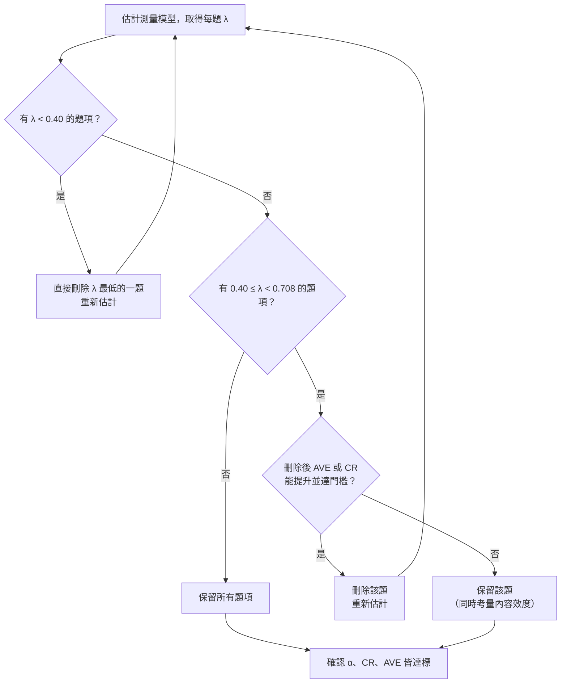

# 3.2 測量模型評鑑：信度與收斂效度 —— Excel 逐步計算範例

> 本範例以一個 **5 題、12 位受試者** 的小型模擬資料，在 Excel 中一步一步算出 PLS-SEM 測量模型（outer model）評鑑所需的四項指標：
> **外部負荷量 λ → Cronbach's α → 組合信度 CR → 平均變異抽取量 AVE**，並示範「刪題 → 重新估計」的完整決策流程。

配套檔案：[`PLS_SEM_measurement_model_example.xlsx`](./PLS_SEM_measurement_model_example.xlsx)（所有數值皆為 Excel 公式，修改原始資料即自動重算）

---

## 目錄

1. [為什麼要先評鑑測量模型](#1-為什麼要先評鑑測量模型)
2. [判斷標準總表](#2-判斷標準總表)
3. [範例資料](#3-範例資料)
4. [Excel 工作表結構](#4-excel-工作表結構)
5. [步驟 0：標準化與構念分數](#5-步驟-0標準化與構念分數)
6. [步驟 1：指標信度（外部負荷量 λ）](#6-步驟-1指標信度外部負荷量-λ)
7. [步驟 2：Cronbach's α](#7-步驟-2cronbachs-α)
8. [步驟 3：組合信度 CR](#8-步驟-3組合信度-cr)
9. [步驟 4：收斂效度 AVE](#9-步驟-4收斂效度-ave)
10. [刪題決策：三輪迭代](#10-刪題決策三輪迭代)
11. [最終結果與論文報告範本](#11-最終結果與論文報告範本)
12. [重要限制與說明](#12-重要限制與說明)
13. [參考文獻](#13-參考文獻)

---

## 1. 為什麼要先評鑑測量模型

PLS-SEM 分析分為兩個層次：

| 層次 | 英文 | 內容 |
|---|---|---|
| 測量模型 | Outer model | 題項（觀察變數）是否有效、穩定地測量其潛在構念 |
| 結構模型 | Inner model | 潛在構念之間的路徑係數、R²、f² 等 |

**鐵律：測量模型未通過品質檢驗前，結構模型的路徑係數解讀沒有意義。**
因為若構念本身測不準，構念之間的關係（路徑係數）也就建立在不可靠的基礎上。

---

## 2. 判斷標準總表

| 評鑑面向 | 指標 | 公式 | 判斷標準 |
|---|---|---|---|
| 指標信度 | 外部負荷量 λ | 題項與構念分數之相關 | λ ≥ 0.708；0.40–0.708 評估是否刪除；< 0.40 直接刪除 |
| 內部一致性信度 | Cronbach's α | $\alpha=\dfrac{k}{k-1}\left(1-\dfrac{\sum \sigma_i^2}{\sigma_T^2}\right)$ | 0.70–0.95（> 0.95 留意題項冗餘） |
| 內部一致性信度 | 組合信度 CR（ρc） | $CR=\dfrac{(\sum\lambda_i)^2}{(\sum\lambda_i)^2+\sum(1-\lambda_i^2)}$ | 0.70–0.95（> 0.95 留意題項冗餘） |
| 收斂效度 | AVE | $AVE=\dfrac{\sum\lambda_i^2}{n}$ | AVE ≥ 0.50 |

> **0.708 的由來：** $0.708^2 \approx 0.50$，也就是該題項的變異量至少有 50% 能被其構念解釋（被解釋的部分大於誤差）。

---

## 3. 範例資料

構念：**學習滿意度（SAT）**，5 題，5 點李克特量表（1 = 非常不同意，5 = 非常同意），n = 12。

| 受試者 | SAT1 | SAT2 | SAT3 | SAT4 | SAT5 |
|:---:|:---:|:---:|:---:|:---:|:---:|
| R01 | 3 | 3 | 3 | 5 | 1 |
| R02 | 2 | 3 | 3 | 3 | 4 |
| R03 | 4 | 3 | 4 | 4 | 3 |
| R04 | 4 | 2 | 4 | 3 | 2 |
| R05 | 3 | 2 | 3 | 2 | 4 |
| R06 | 3 | 3 | 2 | 3 | 2 |
| R07 | 4 | 4 | 3 | 4 | 4 |
| R08 | 2 | 2 | 2 | 3 | 4 |
| R09 | 3 | 3 | 3 | 4 | 5 |
| R10 | 4 | 4 | 5 | 4 | 3 |
| R11 | 5 | 4 | 3 | 2 | 4 |
| R12 | 3 | 3 | 2 | 3 | 3 |

> 資料為教學用模擬資料，刻意設計 SAT5 為「不良題」、SAT4 為「邊緣題」，以便示範刪題流程。

---

## 4. Excel 工作表結構

| 工作表 | 內容 |
|---|---|
| `摘要` | 三輪結果彙整表（公式連結至各輪工作表） |
| `原始資料` | 12 × 5 原始分數（藍字，可修改） |
| `R1_五題` | 第 1 輪：5 題全部納入 |
| `R2_刪SAT5` | 第 2 輪：刪除 SAT5 後重新估計 |
| `R3_刪SAT4` | 第 3 輪：再刪除 SAT4 後重新估計 |

每一輪工作表的版面都相同（以 `R1_五題` 為例）：

| 區塊 | 位置 | 說明 |
|---|---|---|
| 原始分數 | B5:F16 | 連結自 `原始資料` |
| 標準化分數 Z | G5:K16 | 步驟 0 |
| 構念分數 | L5:L16 | 步驟 0 |
| 總分 | M5:M16 | 步驟 2 使用 |
| 外部負荷量 λ、λ²、1−λ² | B20:G22 | 步驟 1 |
| Cronbach's α | B26:B31 | 步驟 2 |
| CR | B34:B38 | 步驟 3 |
| AVE | B41:B44 | 步驟 4 |

黃底儲存格為各指標的最終結果。

---

## 5. 步驟 0：標準化與構念分數

PLS-SEM 的外部負荷量，是「題項」與「潛在構念分數（latent variable score）」之間的相關係數。所以要先算出每位受試者的構念分數。

### 5.1 將每一題標準化（Z 分數）

$$
Z_{ij}=\frac{x_{ij}-\bar{x}_j}{s_j}
$$

Excel（`R1_五題` 的 G5，往右、往下複製）：

```excel
=STANDARDIZE(B5, AVERAGE(B$5:B$16), STDEV(B$5:B$16))
```

> `STDEV` 與 `STDEV.S` 相同，都是樣本標準差（分母 n − 1）。

**手算驗證（R01 的 SAT1）：**
SAT1 平均 = 40 / 12 = 3.333；標準差 = 0.888
$Z = (3 - 3.333) / 0.888 = -0.376$ ✅

### 5.2 計算構念分數

本範例以「各題 Z 分數的等權平均」作為構念分數（L5）：

```excel
=AVERAGE(G5:K5)
```

> ⚠️ 真正的 PLS 演算法會反覆迭代求出「不等權」的外部權重（outer weights），本範例用等權平均作為**教學近似**，目的是讓每一步都能在 Excel 中看得見。詳見[第 12 節](#12-重要限制與說明)。

---

## 6. 步驟 1：指標信度（外部負荷量 λ）

### 6.1 計算 λ

外部負荷量 = 題項分數與構念分數的 Pearson 相關係數（B20，往右複製）：

```excel
=CORREL(B$5:B$16, $L$5:$L$16)
```

> 相關係數不受線性轉換影響，所以用原始分數或 Z 分數算出的 λ 完全相同。

### 6.2 計算 λ² 與 1 − λ²

| 列 | 公式（B 欄） | 意義 |
|---|---|---|
| 21 | `=B20^2` | λ²：該題變異被構念解釋的比例（AVE 會用到） |
| 22 | `=1-B20^2` | 1 − λ²：該題的誤差變異（CR 會用到） |
| 23 | `=IF(B20>=0.708,"保留",IF(B20>=0.4,"評估刪除","直接刪除"))` | 自動判斷 |

G 欄為合計：`=SUM(B20:F20)`、`=SUM(B21:F21)`、`=SUM(B22:F22)`

### 6.3 第 1 輪結果

| | SAT1 | SAT2 | SAT3 | SAT4 | SAT5 | 合計 |
|---|:---:|:---:|:---:|:---:|:---:|:---:|
| λ | 0.696 | 0.788 | 0.711 | 0.421 | **0.195** | 2.810 |
| λ² | 0.485 | 0.621 | 0.505 | 0.177 | 0.038 | 1.825 |
| 1 − λ² | 0.515 | 0.379 | 0.495 | 0.823 | 0.962 | 3.175 |
| 判斷 | 評估刪除 | 保留 | 保留 | 評估刪除 | **直接刪除** | |

SAT5 的 λ = 0.195 < 0.40 → **直接刪除**（見第 10 節）。

---

## 7. 步驟 2：Cronbach's α

$$
\alpha=\frac{k}{k-1}\left(1-\frac{\sum_{i=1}^{k}\sigma_i^2}{\sigma_T^2}\right)
$$

- $k$：題數
- $\sigma_i^2$：第 i 題的變異數
- $\sigma_T^2$：總分的變異數

| 列 | 項目 | Excel 公式 |
|---|---|---|
| 26 | 各題變異數 | `=VAR(B5:B16)`（往右複製；`VAR` = `VAR.S`） |
| 27 | 題數 k | `=COUNT(B20:F20)` |
| 28 | Σ 各題變異數 | `=G26` |
| 29 | 總分變異數 | `=VAR(M5:M16)` |
| 30 | **α** | `=B27/(B27-1)*(1-B28/B29)` |
| 31 | 判斷 | `=IF(B30>0.95,"過高：題項可能冗餘",IF(B30>=0.7,"通過","未通過"))` |

**第 1 輪手算：**

$$
\alpha=\frac{5}{4}\left(1-\frac{4.2273}{6.0000}\right)=1.25\times0.2955=\mathbf{0.369}\ \text{（未通過）}
$$

> α 假設所有題項負荷量相等（tau-equivalent），因此在 PLS-SEM 文獻中被視為**保守**的信度下限估計。

---

## 8. 步驟 3：組合信度 CR

$$
CR=\frac{\left(\sum\lambda_i\right)^2}{\left(\sum\lambda_i\right)^2+\sum\left(1-\lambda_i^2\right)}
$$

分子是「構念造成的變異」，分母是「構念變異 + 誤差變異」。

| 列 | 項目 | Excel 公式 |
|---|---|---|
| 34 | Σλ | `=G20` |
| 35 | (Σλ)² | `=B34^2` |
| 36 | Σ(1 − λ²) | `=G22` |
| 37 | **CR** | `=B35/(B35+B36)` |
| 38 | 判斷 | `=IF(B37>0.95,"過高：題項可能冗餘",IF(B37>=0.7,"通過","未通過"))` |

> 不想拆步驟也可以一行算完：
> ```excel
> =SUM(B20:F20)^2/(SUM(B20:F20)^2+SUMPRODUCT(1-B20:F20^2))
> ```

**第 1 輪手算：**

$$
CR=\frac{2.8102^2}{2.8102^2+3.1747}=\frac{7.8971}{7.8971+3.1747}=\mathbf{0.713}\ \text{（通過）}
$$

> 注意：此時 CR 已通過，但 α 與 AVE 未通過——**CR 通過不代表測量模型沒問題**，四項指標要一起看。

---

## 9. 步驟 4：收斂效度 AVE

$$
AVE=\frac{\sum_{i=1}^{n}\lambda_i^2}{n}
$$

即所有題項 λ² 的平均。

| 列 | 項目 | Excel 公式 |
|---|---|---|
| 41 | Σλ² | `=G21` |
| 42 | 題數 n | `=B27` |
| 43 | **AVE** | `=B41/B42` |
| 44 | 判斷 | `=IF(B43>=0.5,"通過","未通過")` |

> 一行版本：`=SUMSQ(B20:F20)/COUNT(B20:F20)`

**第 1 輪手算：**

$$
AVE=\frac{1.8253}{5}=\mathbf{0.365}\ \text{（未通過）}
$$

---

## 10. 刪題決策：三輪迭代

### 10.1 決策流程



> **一次只刪一題。** 刪掉一題後，構念分數會改變，其他題的 λ 也會跟著改變，必須重新估計後再決定下一步。

### 10.2 第 1 輪 → 第 2 輪：刪除 SAT5

SAT5 的 λ = 0.195 < 0.40，直接刪除。重新估計後（`R2_刪SAT5`）：

| | SAT1 | SAT2 | SAT3 | SAT4 |
|---|:---:|:---:|:---:|:---:|
| λ | 0.733 | 0.754 | 0.755 | **0.552** |

| 指標 | 數值 | 判斷 |
|---|:---:|:---:|
| α | 0.643 | ❌ 未通過 |
| CR | 0.794 | ✅ 通過 |
| AVE | 0.495 | ❌ 未通過 |

觀察：刪除 SAT5 後，**SAT1 的 λ 從 0.696 上升到 0.733**，跨過了 0.708 門檻——這正是「一次刪一題、重新估計」的原因。

### 10.3 第 2 輪 → 第 3 輪：評估 SAT4

SAT4 的 λ = 0.552，落在 0.40–0.708 區間。此時 AVE = 0.495 < 0.50，**未達收斂效度門檻**。
評估刪除 SAT4 的效果（`R3_刪SAT4`）：

| 指標 | 刪除前（4 題） | 刪除後（3 題） | 變化 |
|---|:---:|:---:|:---:|
| α | 0.643 | **0.712** | ⬆ 跨過 0.70 |
| CR | 0.794 | **0.840** | ⬆ |
| AVE | 0.495 | **0.638** | ⬆ 跨過 0.50 |

刪除 SAT4 能讓 α 與 AVE 從「未通過」變成「通過」→ **決定刪除 SAT4**。

> 若刪除前 AVE 與 CR 已經達標，則即使刪除能讓數值更高，也可考慮保留該題，以維持構念的內容效度（content validity）。

### 10.4 第 3 輪（最終模型）完整手算

| | SAT1 | SAT2 | SAT3 | 合計 |
|---|:---:|:---:|:---:|:---:|
| λ | 0.8722 | 0.7645 | 0.7545 | 2.3912 |
| λ² | 0.7607 | 0.5845 | 0.5693 | 1.9145 |
| 1 − λ² | 0.2393 | 0.4155 | 0.4307 | 1.0855 |
| 變異數 | 0.7879 | 0.5455 | 0.8106 | 2.1439 |

總分變異數 = 4.0833

$$
\alpha=\frac{3}{2}\left(1-\frac{2.1439}{4.0833}\right)=1.5\times0.4750=\mathbf{0.712}
$$

$$
CR=\frac{2.3912^2}{2.3912^2+1.0855}=\frac{5.7180}{6.8035}=\mathbf{0.840}
$$

$$
AVE=\frac{1.9145}{3}=\mathbf{0.638}
$$

---

## 11. 最終結果與論文報告範本

### 11.1 三輪彙整（對應 `摘要` 工作表）

| 輪次 | 題數 | SAT1 | SAT2 | SAT3 | SAT4 | SAT5 | α | CR | AVE |
|---|:---:|:---:|:---:|:---:|:---:|:---:|:---:|:---:|:---:|
| R1 | 5 | 0.696 | 0.788 | 0.711 | 0.421 | 0.195 | 0.369 | 0.713 | 0.365 |
| R2 | 4 | 0.733 | 0.754 | 0.755 | 0.552 | — | 0.643 | 0.794 | 0.495 |
| **R3** | **3** | **0.872** | **0.765** | **0.755** | — | — | **0.712** | **0.840** | **0.638** |

### 11.2 論文表格範本

**表 X　測量模型之信度與收斂效度**

| 構念 | 題項 | 外部負荷量 | Cronbach's α | CR | AVE |
|---|---|:---:|:---:|:---:|:---:|
| 學習滿意度（SAT） | SAT1 | 0.872 | 0.712 | 0.840 | 0.638 |
| | SAT2 | 0.765 | | | |
| | SAT3 | 0.755 | | | |

註：SAT5（λ = 0.195）與 SAT4（λ = 0.552）已刪除。

### 11.3 文字報告範本

> 本研究依 Hair et al.（2019）之建議評鑑測量模型。初始模型中，SAT5 之外部負荷量為 0.195，低於 0.40，故予以刪除；重新估計後，SAT4 之外部負荷量為 0.552，且構念之 AVE（0.495）未達 0.50 門檻，刪除 SAT4 後 AVE 提升至 0.638，故亦予以刪除。最終模型中，各題項外部負荷量介於 0.755 至 0.872，皆高於 0.708；Cronbach's α 為 0.712，組合信度為 0.840，均介於 0.70 至 0.95 之間，顯示具良好內部一致性信度；AVE 為 0.638，高於 0.50，顯示具收斂效度。

---

## 12. 重要限制與說明

1. **λ 為教學近似值。** 本範例以「標準化題項之等權平均」作為構念分數。SmartPLS 等軟體的 PLS 演算法會以迭代方式估計外部權重（Mode A），因此實際軟體輸出的 λ、CR、AVE 會與本範例略有差異。但**公式本身與判斷邏輯完全相同**：只要把軟體輸出的 λ 貼進 Excel 的 λ 列，CR 與 AVE 的計算即與軟體一致。
2. **Cronbach's α 之計算基礎。** 本範例以原始分數計算 α；部分 PLS 軟體以標準化資料計算，兩者在題項變異數差異大時可能略有不同。
3. **樣本數。** n = 12 僅為示範計算流程，實際研究應依統計檢定力分析或「10 倍法則」等準則決定樣本數。
4. **刪題需兼顧內容效度。** 統計指標不是唯一依據；若刪除某題會使構念的理論定義不完整，應審慎考量是否保留。
5. **本節僅涵蓋信度與收斂效度。** 完整的測量模型評鑑還需檢驗**區別效度**（Fornell-Larcker 準則、交叉負荷、HTMT），通過後才能進入結構模型分析。

---

## 13. 參考文獻

- Fornell, C., & Larcker, D. F. (1981). Evaluating structural equation models with unobservable variables and measurement error. *Journal of Marketing Research, 18*(1), 39–50.
- Hair, J. F., Hult, G. T. M., Ringle, C. M., & Sarstedt, M. (2022). *A primer on partial least squares structural equation modeling (PLS-SEM)* (3rd ed.). Sage.
- Hair, J. F., Risher, J. J., Sarstedt, M., & Ringle, C. M. (2019). When to use and how to report the results of PLS-SEM. *European Business Review, 31*(1), 2–24.
- Hair, J. F., Ringle, C. M., & Sarstedt, M. (2011). PLS-SEM: Indeed a silver bullet. *Journal of Marketing Theory and Practice, 19*(2), 139–152.
