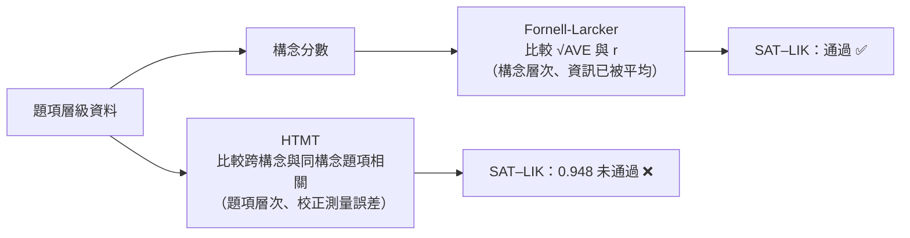
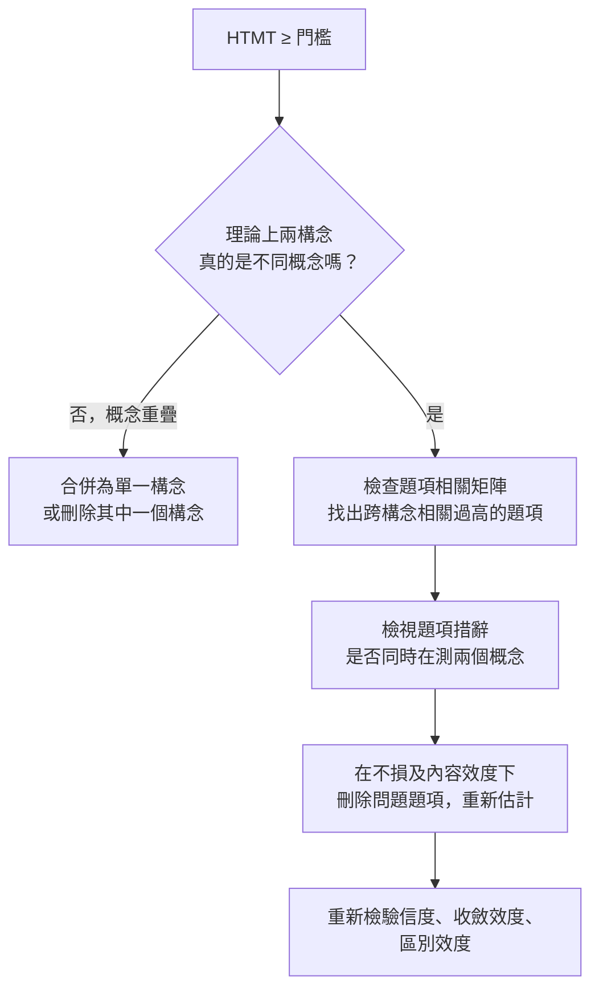

# 3.3 區別效度：Fornell-Larcker 準則與 HTMT 比率 —— Excel 逐步計算範例

> 延續 [3.2 信度與收斂效度](3_2測量模型評鑑_信度與收斂效度.md) 的做法，本範例使用 **3 個構念 × 3 題、20 位受試者** 的模擬資料，在 Excel 中逐步計算：
> **構念分數 → √AVE → 構念相關矩陣 → Fornell-Larcker 準則 → 題項相關矩陣 → HTMT**。
>
> 本範例刻意設計了一組「**Fornell-Larcker 判定通過，HTMT 判定失敗**」的構念配對，用來說明為什麼近年文獻建議以 HTMT 為主要依據。

配套檔案：[`PLS_SEM_discriminant_validity_example.xlsx`](./PLS_SEM_discriminant_validity_example.xlsx)（所有數值皆為 Excel 公式，修改原始資料即自動重算）

---

## 目錄

1. [什麼是區別效度](#1-什麼是區別效度)
2. [判斷標準總表](#2-判斷標準總表)
3. [範例資料](#3-範例資料)
4. [Excel 工作表結構](#4-excel-工作表結構)
5. [步驟 1：構念分數與 √AVE（前置作業）](#5-步驟-1構念分數與-ave前置作業)
6. [步驟 2：Fornell-Larcker 準則](#6-步驟-2fornell-larcker-準則)
7. [步驟 3：題項相關矩陣](#7-步驟-3題項相關矩陣)
8. [步驟 4：HTMT 比率](#8-步驟-4htmt-比率)
9. [兩種準則的比較：為什麼結論不同](#9-兩種準則的比較為什麼結論不同)
10. [區別效度不足時怎麼辦](#10-區別效度不足時怎麼辦)
11. [論文報告範本](#11-論文報告範本)
12. [重要限制與說明](#12-重要限制與說明)
13. [參考文獻](#13-參考文獻)

---

## 1. 什麼是區別效度

區別效度（discriminant validity）檢驗的是：**理論上應該不同的構念，在資料層次上是否真的可以被明確區分。**

如果兩個構念的題項在資料上幾乎分不開，代表它們可能在測量同一件事。這時在結構模型中把兩者放成「A → B」，所得到的高路徑係數可能只是「同一個東西和自己相關」，並沒有實質意義。

| 效度類型 | 檢驗的問題 | 對應指標（本週） |
|---|---|---|
| 收斂效度（3.2） | 同一構念的題項，是否「聚在一起」？ | AVE ≥ 0.50 |
| 區別效度（3.3） | 不同構念的題項，是否「彼此分開」？ | Fornell-Larcker、HTMT |

> **前提：** 區別效度是在信度與收斂效度通過之後才檢驗。本範例三個構念的 λ、CR、AVE 都已通過（見步驟 1）。

---

## 2. 判斷標準總表

| 準則 | 公式 | 判斷標準 |
|---|---|---|
| Fornell-Larcker（1981） | $\sqrt{AVE_i} > r_{ij}\quad \forall j\neq i$ | 每個構念的 √AVE 大於它與其他所有構念的相關 |
| HTMT（Henseler et al., 2015） | 見下方 | HTMT < 0.90（概念差異大的構念，採更嚴格的 < 0.85） |


$$
HTMT_{ij}=\frac{\dfrac{1}{n_i n_j}\displaystyle\sum_{k=1}^{n_i}\sum_{l=1}^{n_j}\left|r_{ik,jl}\right|}{\sqrt{\dfrac{2}{n_i(n_i-1)}\displaystyle\sum_{k<k'}\left|r_{ik,ik'}\right|\cdot\dfrac{2}{n_j(n_j-1)}\displaystyle\sum_{l<l'}\left|r_{jl,jl'}\right|}}
$$


用白話拆解這個公式：

| 部分 | 白話 | 本範例（每構念 3 題）有幾個相關係數 |
|---|---|---|
| 分子 | 構念 i 的題項與構念 j 的題項之間，**所有跨構念相關的平均**（heterotrait） | $n_i \times n_j = 3\times3 = 9$ 個 |
| 分母中的 $\frac{2}{n_i(n_i-1)}\sum$ | 構念 i **內部**題項兩兩相關的平均（monotrait） | $\frac{3\times2}{2}=3$ 個 |
| 分母 | 兩個構念 monotrait 平均的**幾何平均數** | — |

**直覺：** 如果「跨構念的題項相關」幾乎和「同構念的題項相關」一樣高，HTMT 就會接近 1，代表兩個構念在資料上分不開。

---

## 3. 範例資料

| 構念 | 代號 | 題項 | 設計意圖 |
|---|---|---|---|
| 學習滿意度 | SAT | SAT1–SAT3 | — |
| 課程喜愛度 | LIK | LIK1–LIK3 | 與 SAT 概念非常接近（刻意設計區別效度不足） |
| 學習自我效能 | SE | SE1–SE3 | 與 SAT、LIK 概念明顯不同 |

5 點李克特量表，n = 20：

| 受試者 | SAT1 | SAT2 | SAT3 | LIK1 | LIK2 | LIK3 | SE1 | SE2 | SE3 |
|:---:|:---:|:---:|:---:|:---:|:---:|:---:|:---:|:---:|:---:|
| R01 | 3 | 4 | 3 | 5 | 4 | 4 | 4 | 2 | 2 |
| R02 | 4 | 4 | 4 | 3 | 4 | 3 | 3 | 3 | 3 |
| R03 | 4 | 5 | 4 | 4 | 4 | 5 | 4 | 4 | 4 |
| R04 | 5 | 5 | 4 | 3 | 4 | 3 | 4 | 2 | 4 |
| R05 | 3 | 3 | 3 | 3 | 4 | 3 | 2 | 3 | 2 |
| R06 | 4 | 2 | 3 | 3 | 3 | 3 | 2 | 2 | 3 |
| R07 | 4 | 4 | 3 | 3 | 4 | 4 | 3 | 4 | 4 |
| R08 | 2 | 3 | 3 | 3 | 4 | 3 | 5 | 4 | 4 |
| R09 | 5 | 5 | 5 | 4 | 5 | 5 | 2 | 3 | 3 |
| R10 | 4 | 4 | 5 | 4 | 3 | 4 | 3 | 3 | 4 |
| R11 | 2 | 1 | 2 | 3 | 2 | 2 | 1 | 2 | 2 |
| R12 | 3 | 3 | 4 | 3 | 4 | 3 | 4 | 4 | 4 |
| R13 | 4 | 5 | 4 | 4 | 4 | 4 | 5 | 4 | 5 |
| R14 | 2 | 2 | 3 | 3 | 3 | 3 | 5 | 4 | 4 |
| R15 | 4 | 3 | 3 | 3 | 3 | 3 | 5 | 5 | 5 |
| R16 | 2 | 3 | 2 | 3 | 3 | 3 | 2 | 2 | 2 |
| R17 | 1 | 2 | 1 | 3 | 1 | 2 | 3 | 3 | 3 |
| R18 | 3 | 5 | 4 | 3 | 4 | 3 | 5 | 5 | 5 |
| R19 | 3 | 3 | 3 | 3 | 3 | 3 | 2 | 3 | 3 |
| R20 | 1 | 2 | 2 | 2 | 3 | 2 | 2 | 3 | 2 |

---

## 4. Excel 工作表結構

| 工作表 | 內容 | 關鍵位置 |
|---|---|---|
| `摘要` | FL 與 HTMT 對照表 | A3:G6 |
| `原始資料` | 20 × 9 原始分數（藍字，可修改） | B5:J24 |
| `1_構念分數` | Z 分數、構念分數、λ、CR、AVE、√AVE | 構念分數 T:V；λ 第 29 列；√AVE H35:H37 |
| `2_FL準則` | 構念相關矩陣（對角線為 √AVE）與逐一判斷 | 矩陣 B5:D7；判斷 A11:E13 |
| `3_題項相關` | 9 × 9 題項相關矩陣（綠底 monotrait、橘底 heterotrait） | B5:J13 |
| `4_HTMT` | monotrait 平均、heterotrait 平均、HTMT 矩陣與判斷 | 第 6–8、12–14、18–20、24–26 列 |

---

## 5. 步驟 1：構念分數與 √AVE（前置作業）

做法與 3.2 節相同，這裡只列公式。

| 計算 | 儲存格 | Excel 公式 |
|---|---|---|
| Z 分數 | K5（往右、往下複製） | `=STANDARDIZE(B5,AVERAGE(B$5:B$24),STDEV(B$5:B$24))` |
| SAT 構念分數 | T5 | `=AVERAGE(K5:M5)` |
| LIK 構念分數 | U5 | `=AVERAGE(N5:P5)` |
| SE 構念分數 | V5 | `=AVERAGE(Q5:S5)` |
| SAT1 的 λ | B29 | `=CORREL(B$5:B$24,T$5:T$24)` |
| AVE | G35 | `=C35/E35`（Σλ² ÷ 題數） |
| **√AVE** | H35 | `=SQRT(G35)` |

**結果（三個構念的測量品質皆通過）：**

| 構念 | λ 範圍 | CR | AVE | √AVE |
|---|:---:|:---:|:---:|:---:|
| SAT | 0.900 – 0.930 | 0.939 | 0.837 | **0.915** |
| LIK | 0.792 – 0.949 | 0.891 | 0.733 | **0.856** |
| SE | 0.900 – 0.939 | 0.939 | 0.837 | **0.915** |

---

## 6. 步驟 2：Fornell-Larcker 準則

### 6.1 邏輯

- **√AVE**：構念與「自己的題項」之間的平均關聯強度
- **r<sub>ij</sub>**：構念與「另一個構念」之間的相關

準則要求：**一個構念和自己的題項的關係，要比它和其他構念的關係更強。**

### 6.2 建立 Fornell-Larcker 矩陣

| 位置 | 內容 | Excel 公式（以 `2_FL準則` 為例） |
|---|---|---|
| 對角線 B5 | SAT 的 √AVE | `='1_構念分數'!H35` |
| 下三角 B6 | SAT 與 LIK 構念分數之相關 | `=CORREL('1_構念分數'!T$5:T$24,'1_構念分數'!U$5:U$24)` |
| 上三角 | 留白（與下三角對稱） | — |

**結果：**

| | SAT | LIK | SE |
|---|:---:|:---:|:---:|
| **SAT** | **0.915** | | |
| **LIK** | 0.813 | **0.856** | |
| **SE** | 0.374 | 0.234 | **0.915** |

（對角線粗體 = √AVE；非對角線 = 構念間相關 r）

### 6.3 逐一判斷

**判讀方法：** 每個對角線數值，要大於它**同一列左方**與**同一欄下方**的所有數值。

| 構念 | √AVE | 與其他構念最大 \|r\| | 差距 | 判斷 |
|---|:---:|:---:|:---:|:---:|
| SAT | 0.915 | 0.813（LIK） | 0.102 | ✅ 通過 |
| LIK | 0.856 | 0.813（SAT） | **0.043** | ✅ 通過 |
| SE | 0.915 | 0.374（SAT） | 0.541 | ✅ 通過 |

Excel 公式（C12，LIK 列）：

```excel
=MAX(ABS(B6),ABS(C7))
```

判斷（E12）：`=IF(B12>C12,"通過","未通過")`

> 依 Fornell-Larcker 準則，**三個構念全部具區別效度**。但請注意 LIK 的差距只有 0.043——這是警訊，下一步用 HTMT 檢驗。

---

## 7. 步驟 3：題項相關矩陣

HTMT 不使用構念分數，而是直接使用**題項層級**的相關係數。所以先建立 9 × 9 題項相關矩陣。

`3_題項相關` 的 B5（往右、往下複製時需調整欄位）：

```excel
=CORREL('1_構念分數'!B$5:B$24,'1_構念分數'!B$5:B$24)
```

C5（SAT1 與 SAT2）：

```excel
=CORREL('1_構念分數'!B$5:B$24,'1_構念分數'!C$5:C$24)
```

**結果（只列上三角；🟩 = monotrait，🟧 = heterotrait）：**

| | SAT1 | SAT2 | SAT3 | LIK1 | LIK2 | LIK3 | SE1 | SE2 | SE3 |
|---|:---:|:---:|:---:|:---:|:---:|:---:|:---:|:---:|:---:|
| SAT1 | 1 | 🟩 .716 | 🟩 .797 | 🟧 .436 | 🟧 .635 | 🟧 .694 | 🟧 .140 | 🟧 .058 | 🟧 .417 |
| SAT2 | | 1 | 🟩 .755 | 🟧 .536 | 🟧 .742 | 🟧 .754 | 🟧 .414 | 🟧 .265 | 🟧 .482 |
| SAT3 | | | 1 | 🟧 .465 | 🟧 .742 | 🟧 .713 | 🟧 .297 | 🟧 .254 | 🟧 .493 |
| LIK1 | | | | 1 | 🟩 .348 | 🟩 .751 | 🟧 .222 | 🟧 −.107 | 🟧 .079 |
| LIK2 | | | | | 1 | 🟩 .680 | 🟧 .287 | 🟧 .230 | 🟧 .250 |
| LIK3 | | | | | | 1 | 🟧 .214 | 🟧 .176 | 🟧 .296 |
| SE1 | | | | | | | 1 | 🟩 .690 | 🟩 .796 |
| SE2 | | | | | | | | 1 | 🟩 .781 |
| SE3 | | | | | | | | | 1 |

**先用眼睛看一個關鍵現象：**
LIK2 與**自己構念**的 LIK1 相關只有 **0.348**，卻與**另一個構念**的 SAT2、SAT3 相關高達 **0.742**。也就是說，LIK2 跟 SAT 題項的關係，比跟自己構念的題項還要密切。

---

## 8. 步驟 4：HTMT 比率

以 **SAT – LIK** 這組為例，完整手算一次。

### 8.1 Monotrait：構念內題項相關平均

每個構念 3 題，有 $\frac{3\times2}{2}=3$ 個題項配對。

| 構念 | 相關 1 | 相關 2 | 相關 3 | 平均 monotrait |
|---|:---:|:---:|:---:|:---:|
| SAT | .716（S1–S2） | .797（S1–S3） | .755（S2–S3） | **0.7559** |
| LIK | .348（L1–L2） | .751（L1–L3） | .680（L2–L3） | **0.5931** |
| SE | .690（E1–E2） | .796（E1–E3） | .781（E2–E3） | **0.7556** |

Excel（`4_HTMT`）：

```excel
B6:  =ABS('3_題項相關'!C5)      ← SAT1–SAT2
C6:  =ABS('3_題項相關'!D5)      ← SAT1–SAT3
D6:  =ABS('3_題項相關'!D6)      ← SAT2–SAT3
E6:  =3*(3-1)/2                ← 配對數
F6:  =SUM(B6:D6)/E6            ← 平均 monotrait
```

$$
\overline{mono}_{SAT}=\frac{0.716+0.797+0.755}{3}=0.7559
\qquad
\overline{mono}_{LIK}=\frac{0.348+0.751+0.680}{3}=0.5931
$$

### 8.2 Heterotrait：跨構念題項相關平均

SAT 的 3 題 × LIK 的 3 題 = 9 個相關係數（題項相關矩陣中的 E5:G7 區塊）：

| | LIK1 | LIK2 | LIK3 |
|---|:---:|:---:|:---:|
| SAT1 | .436 | .635 | .694 |
| SAT2 | .536 | .742 | .754 |
| SAT3 | .465 | .742 | .713 |

Excel：

```excel
B12: =SUMPRODUCT(ABS('3_題項相關'!E5:G7))   ← Σ|r| = 5.7154
C12: =COUNT('3_題項相關'!E5:G7)             ← 9
D12: =B12/C12                               ← 平均 heterotrait
```

$$
\overline{hetero}_{SAT,LIK}=\frac{5.7154}{9}=0.6350
$$

> 為什麼用 `SUMPRODUCT(ABS(...))` 而不是 `SUM(ABS(...))`？因為 `ABS` 作用在一個範圍上時需要陣列運算，`SUMPRODUCT` 可以直接處理陣列，不必按 Ctrl+Shift+Enter。

### 8.3 計算 HTMT

```excel
E12: =SQRT(F6*F7)     ← 分母：幾何平均
F12: =D12/E12         ← HTMT
```

$$
HTMT_{SAT,LIK}=\frac{0.6350}{\sqrt{0.7559\times0.5931}}=\frac{0.6350}{0.6696}=\mathbf{0.948}
$$

### 8.4 HTMT 結果

| 配對 | 平均 hetero | √(mono × mono) | **HTMT** | < 0.85 | < 0.90 |
|---|:---:|:---:|:---:|:---:|:---:|
| SAT – LIK | 0.6350 | 0.6696 | **0.948** | ❌ | ❌ |
| SAT – SE | 0.3134 | 0.7558 | **0.415** | ✅ | ✅ |
| LIK – SE | 0.2066 | 0.6694 | **0.309** | ✅ | ✅ |

**HTMT 矩陣（論文常用格式）：**

| | SAT | LIK | SE |
|---|:---:|:---:|:---:|
| SAT | | | |
| LIK | **0.948** | | |
| SE | 0.415 | 0.309 | |

> **關於絕對值：** LIK1 與 SE2 的相關為 −0.107。若不取絕對值，正負相關會互相抵消，使 LIK–SE 的 HTMT 被低估（本例會從 0.309 降為 0.273）。因此公式中的 $|r|$ 不可省略。

---

## 9. 兩種準則的比較：為什麼結論不同

| 構念配對 | r | 較小 √AVE | **Fornell-Larcker** | **HTMT** | **HTMT 判斷** |
|---|:---:|:---:|:---:|:---:|:---:|
| SAT – LIK | 0.813 | 0.856 | ✅ 通過 | 0.948 | ❌ 未通過 |
| SAT – SE | 0.374 | 0.915 | ✅ 通過 | 0.415 | ✅ 通過 |
| LIK – SE | 0.234 | 0.856 | ✅ 通過 | 0.309 | ✅ 通過 |

**同一份資料，Fornell-Larcker 說 SAT 與 LIK 可以區分，HTMT 說不行。** 原因有三：

1. **Fornell-Larcker 用的是「已被平均過」的資訊。** √AVE 和 r 都是構念層次的摘要值。LIK2 這種「跟別的構念比跟自己構念更親近」的題項層次問題，在平均之後就被掩蓋了。HTMT 直接看題項相關，能看見這個問題。
2. **構念分數之間的相關 r 被測量誤差「稀釋」了。** 測量誤差會讓兩個構念分數的相關看起來比真實相關低，使 r 更容易小於 √AVE。HTMT 的分母等於是把測量誤差的影響校正回來，因此可以理解為「如果兩個構念被完美測量，它們的相關會是多少」的估計值。0.948 的意思是：SAT 與 LIK 的真實相關可能接近 0.95，幾乎是同一個構念。
3. **√AVE 會隨負荷量變高而變寬鬆。** 當題項負荷量都很高（例如 0.80–0.95），√AVE 也會很高，門檻變得很容易跨過。Henseler et al.（2015）的模擬研究正是發現：在負荷量高且相近的常見情境下，Fornell-Larcker 準則幾乎偵測不到區別效度不足的問題。



---

## 10. 區別效度不足時怎麼辦



以本例來說：

- **先問理論：** 「學習滿意度」與「課程喜愛度」在理論上是否真的不同？若研究者無法清楚說明兩者差異，最合理的做法是合併成一個構念。
- **再看題項：** 若理論上確實應區分，LIK2 是首要檢查對象。它與 SAT2、SAT3 的相關（0.742）遠高於與 LIK1 的相關（0.348），可檢視其措辭是否更像在測「滿意度」。
- **刪題後必須重跑：** 刪題會改變構念分數與所有指標，需依 3.2 → 3.3 的順序全部重新檢驗。

---

## 11. 論文報告範本

**表 X　區別效度檢驗：Fornell-Larcker 準則**

| | SAT | LIK | SE |
|---|:---:|:---:|:---:|
| SAT | **0.915** | | |
| LIK | 0.813 | **0.856** | |
| SE | 0.374 | 0.234 | **0.915** |

註：對角線粗體為 AVE 之平方根，非對角線為構念間相關係數。

**表 Y　區別效度檢驗：HTMT**

| | SAT | LIK | SE |
|---|:---:|:---:|:---:|
| SAT | | | |
| LIK | 0.948 | | |
| SE | 0.415 | 0.309 | |

**文字報告範本：**

> 本研究以 Fornell-Larcker 準則及 HTMT 比率檢驗區別效度。依 Fornell-Larcker 準則，各構念 AVE 之平方根（0.856–0.915）均大於其與其他構念之相關係數（0.234–0.813）。然而，依 Henseler et al.（2015）之建議，HTMT 結果顯示學習滿意度與課程喜愛度之 HTMT 為 0.948，超過 0.90 之門檻，顯示兩構念之區別效度不足；其餘構念配對之 HTMT 介於 0.309 至 0.415，均低於 0.85。由於 HTMT 對區別效度不足之偵測較 Fornell-Larcker 準則敏感，本研究以 HTMT 結果為主要依據，並進一步〔合併兩構念／檢視並修訂題項〕。

---

## 12. 重要限制與說明

1. **構念分數為教學近似值。** 與 3.2 節相同，構念分數採等權平均，SmartPLS 等軟體以迭代權重估計，Fornell-Larcker 矩陣中的 r 與 √AVE 會略有差異。**HTMT 只用到題項相關，不受構念分數估計方式影響**，因此本範例的 HTMT 計算與軟體採用相同的邏輯。
2. **HTMT 的統計推論。** 本範例只比較 HTMT 點估計值與門檻。實務上建議以 bootstrapping 取得 HTMT 的信賴區間：Henseler et al.（2015）提出檢驗信賴區間是否包含 1（HTMT<sub>inference</sub>），Franke 與 Sarstedt（2019）則建議檢驗信賴區間上界是否低於 0.85 或 0.90。這部分將在 Colab 實作中示範。
3. **交叉負荷（cross-loadings）。** 另一個傳統準則要求每個題項在自己構念上的負荷量高於在其他構念上的負荷量。其敏感度問題與 Fornell-Larcker 類似，在 Henseler et al.（2015）的模擬中表現更差，故本週不另行展開。
4. **樣本數。** n = 20 僅為示範計算流程，實際研究需更大樣本，HTMT 的 bootstrapping 信賴區間在小樣本下會非常寬。
5. **門檻選擇需事先說明。** 0.85 或 0.90 應依構念在概念上的相近程度決定，並在研究方法中事先交代，不宜看完結果再挑選對自己有利的門檻。

---

## 13. 參考文獻

- Fornell, C., & Larcker, D. F. (1981). Evaluating structural equation models with unobservable variables and measurement error. *Journal of Marketing Research, 18*(1), 39–50.
- Franke, G., & Sarstedt, M. (2019). Heuristics versus statistics in discriminant validity testing: A comparison of four procedures. *Internet Research, 29*(3), 430–447.
- Hair, J. F., Hult, G. T. M., Ringle, C. M., & Sarstedt, M. (2022). *A primer on partial least squares structural equation modeling (PLS-SEM)* (3rd ed.). Sage.
- Hair, J. F., Risher, J. J., Sarstedt, M., & Ringle, C. M. (2019). When to use and how to report the results of PLS-SEM. *European Business Review, 31*(1), 2–24.
- Henseler, J., Ringle, C. M., & Sarstedt, M. (2015). A new criterion for assessing discriminant validity in variance-based structural equation modeling. *Journal of the Academy of Marketing Science, 43*(1), 115–135.
