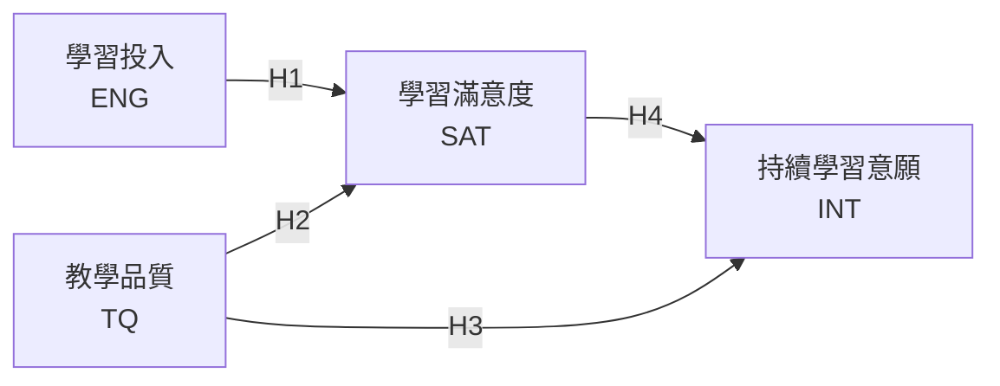
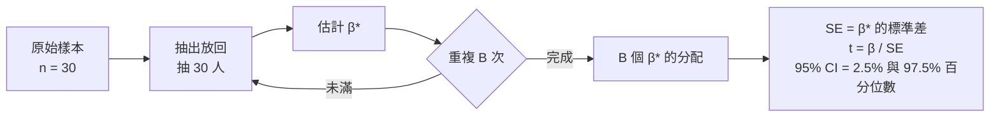

# 3.4 結構模型評鑑：R²、f²、Q² 與路徑係數 —— Excel 逐步計算範例

> 延續 3.2 信度與收斂效度、3.3 區別效度 的做法，本範例使用 **4 個構念 × 3 題、30 位受試者** 的模擬資料，在 Excel 中逐步計算：
> **構念分數 → VIF → 路徑係數 β → R² → f² → Q² → Bootstrapping 顯著性 → GoF**。

配套檔案：[`PLS_SEM_structural_model_example.xlsx`](./PLS_SEM_structural_model_example.xlsx)（所有數值皆為 Excel 公式，修改原始資料即自動重算）

---

## 目錄

1. [結構模型評鑑的順序](#1-結構模型評鑑的順序)
2. [判斷標準總表](#2-判斷標準總表)
3. [研究模型與範例資料](#3-研究模型與範例資料)
4. [Excel 工作表結構](#4-excel-工作表結構)
5. [步驟 0：構念分數（測量模型已通過）](#5-步驟-0構念分數測量模型已通過)
6. [步驟 1：共線性檢查 VIF](#6-步驟-1共線性檢查-vif)
7. [步驟 2：路徑係數 β](#7-步驟-2路徑係數-β)
8. [步驟 3：判定係數 R²](#8-步驟-3判定係數-r)
9. [步驟 4：效果量 f²](#9-步驟-4效果量-f)
10. [步驟 5：預測相關性 Q²](#10-步驟-5預測相關性-q)
11. [步驟 6：Bootstrapping 路徑係數顯著性](#11-步驟-6bootstrapping-路徑係數顯著性)
12. [步驟 7：GoF（僅供參考）](#12-步驟-7gof僅供參考)
13. [綜合判讀：四個指標各自回答什麼問題](#13-綜合判讀四個指標各自回答什麼問題)
14. [論文報告範本](#14-論文報告範本)
15. [重要限制與說明](#15-重要限制與說明)
16. [參考文獻](#16-參考文獻)

---

## 1. 結構模型評鑑的順序


綠色兩步屬於測量模型，必須先通過。結構模型的第一步是 **VIF**：Hair et al.（2019）建議在解讀路徑係數前，先確認預測變數之間沒有嚴重共線性，否則 β 會不穩定。

---

## 2. 判斷標準總表

| 指標 | 回答的問題 | 公式 | 判斷標準 |
|---|---|---|---|
| VIF | 預測變數之間是否重疊太多？ | $VIF=\dfrac{1}{1-R^2_{x_j \mid \text{其他}x}}$ | < 3 理想；< 5 可接受 |
| 路徑係數 β | 影響方向與強度？是否顯著？ | 標準化迴歸係數 | Bootstrapping：p < .05 且 95% CI 不含 0 |
| R² | 內生構念被解釋了多少？ | $1-\dfrac{SSE}{SST}$ | ≥ 0.75 高；0.50–0.75 中；0.25–0.50 低 |
| f² | 單一外生構念的邊際貢獻？ | $\dfrac{R^2_{incl}-R^2_{excl}}{1-R^2_{incl}}$ | 0.02 小；0.15 中；0.35 大 |
| Q² | 模型能否預測沒看過的資料？ | $1-\dfrac{PRESS}{SSO}$ | > 0 具預測相關性（0.25 中、0.50 大） |
| GoF | （整體摘要，僅供參考） | $\sqrt{\overline{AVE}\times\overline{R^2}}$ | 不建議作為模型適配判斷依據 |

---

## 3. 研究模型與範例資料

### 3.1 研究模型



| 類型 | 構念 | 說明 |
|---|---|---|
| 外生構念（exogenous） | ENG、TQ | 只發出箭頭，模型不解釋它們 |
| 內生構念（endogenous） | SAT、INT | 有箭頭指入，會計算 R²、Q² |

> SAT 同時是 INT 的預測變數，因此在 INT 的方程式中扮演外生角色；但它本身仍是內生構念（被 ENG、TQ 解釋）。

這個模型可以拆成兩條迴歸方程式：

$$
SAT = \beta_1 \cdot ENG + \beta_2 \cdot TQ + \varepsilon_1
$$

$$
INT = \beta_3 \cdot TQ + \beta_4 \cdot SAT + \varepsilon_2
$$

### 3.2 範例資料

12 題（ENG1–3、TQ1–3、SAT1–3、INT1–3），5 點李克特量表，n = 30。完整原始資料見 Excel 的 `原始資料` 工作表。測量模型品質如下（皆通過 3.2、3.3 節之標準）：

| 構念 | λ 範圍 | CR | AVE |
|---|:---:|:---:|:---:|
| ENG | 0.850 – 0.909 | 0.912 | 0.775 |
| TQ | 0.897 – 0.934 | 0.939 | 0.837 |
| SAT | 0.871 – 0.913 | 0.924 | 0.803 |
| INT | 0.883 – 0.932 | 0.934 | 0.826 |

---

## 4. Excel 工作表結構

| 工作表 | 內容 |
|---|---|
| `摘要` | 路徑係數、f²、R²、Q²、GoF 彙整 |
| `原始資料` | 30 × 12 原始分數（藍字，可修改） |
| `1_構念分數` | Z 分數、標準化構念分數（AD:AG 欄，黃底）、λ、AVE |
| `2_路徑與R2` | VIF、β（LINEST）、OLS 顯著性、R²、調整後 R² |
| `3_f2` | 每條路徑的 R²<sub>included</sub>、R²<sub>excluded</sub>、f² |
| `4_Q2` | 留一交叉驗證：hat 值、留一殘差、PRESS、Q² |
| `Boot_抽樣次數` | 500 次 bootstrap 重抽的抽樣次數矩陣（30 × 500） |
| `5_Bootstrap` | 500 次重抽之 β、SE、t、p、95% CI |
| `6_GoF` | GoF 計算 |

---

## 5. 步驟 0：構念分數（測量模型已通過）

結構模型的輸入是**構念分數**（latent variable scores）。延續前兩節的教學近似：

1. 每題標準化：`=STANDARDIZE(B5,AVERAGE(B$5:B$34),STDEV(B$5:B$34))`
2. 同構念 Z 分數取平均：`=AVERAGE(N5:P5)`
3. **再標準化一次**，讓構念分數平均 = 0、標準差 = 1：

```excel
AD5: =STANDARDIZE(Z5,AVERAGE(Z$5:Z$34),STDEV(Z$5:Z$34))
```

> **為什麼要再標準化？** 構念分數標準化後，迴歸係數就是**標準化路徑係數**，可以直接比較不同路徑的影響大小，這也是 PLS-SEM 軟體報告的路徑係數。

---

## 6. 步驟 1：共線性檢查 VIF

當一個內生構念有兩個以上預測變數時，要檢查預測變數之間是否高度相關。本例每條方程式都只有兩個預測變數，VIF 可簡化為：

$$
VIF = \frac{1}{1-r_{x_1x_2}^2}
$$

Excel（`2_路徑與R2` 的 C6、D6）：

```excel
C6: =CORREL('1_構念分數'!AD$5:AD$34,'1_構念分數'!AE$5:AE$34)   ← ENG 與 TQ 的相關
D6: =1/(1-C6^2)
```

| 內生構念 | 預測變數 | r | VIF | 判斷 |
|---|---|:---:|:---:|:---:|
| SAT | ENG、TQ | 0.489 | **1.314** | ✅ 理想 |
| INT | TQ、SAT | 0.654 | **1.745** | ✅ 理想 |

$$
VIF_{SAT}=\frac{1}{1-0.4886^2}=\frac{1}{0.7613}=1.314
$$

> 若有三個以上預測變數，VIF 需以「該預測變數對其他所有預測變數做迴歸」的 R² 計算：$VIF_j = 1/(1-R^2_j)$。

---

## 7. 步驟 2：路徑係數 β

### 7.1 用 LINEST 一次取得

`LINEST` 是 Excel 的多元迴歸函數，回傳一個 5 列的結果陣列：

| | 第 1 欄 | 第 2 欄 | 第 3 欄 |
|---|---|---|---|
| 第 1 列 | **最後一個 X 的係數** | 第一個 X 的係數 | 截距 |
| 第 2 列 | 其標準誤 | 其標準誤 | 截距標準誤 |
| 第 3 列 | **R²** | 估計標準誤 | |
| 第 4 列 | F 值 | **自由度 df** | |
| 第 5 列 | SSR | SSE | |

> ⚠️ **LINEST 的係數順序是反過來的**：X 範圍若是 ENG、TQ 兩欄，第 1 欄是 TQ 的係數，第 2 欄才是 ENG 的係數。這是最常見的錯誤。

用 `INDEX` 從陣列中取值（`2_路徑與R2`）：

```excel
B11（ENG→SAT）: =INDEX(LINEST(SAT分數, ENG:TQ兩欄, TRUE, TRUE), 1, 2)
B12（TQ→SAT）:  =INDEX(LINEST(SAT分數, ENG:TQ兩欄, TRUE, TRUE), 1, 1)
```

實際公式：

```excel
=INDEX(LINEST('1_構念分數'!AF$5:AF$34,'1_構念分數'!AD$5:AE$34,TRUE,TRUE),1,2)
```

### 7.2 手算驗證：從相關係數求 β

兩個預測變數時，標準化 β 可以直接由相關係數算出：

$$
\beta_1=\frac{r_{y1}-r_{y2}\,r_{12}}{1-r_{12}^2}
\qquad
\beta_2=\frac{r_{y2}-r_{y1}\,r_{12}}{1-r_{12}^2}
$$

以 SAT 方程式為例： $r_{SAT,ENG}=0.5744$ ， $r_{SAT,TQ}=0.6535$ ， $r_{ENG,TQ}=0.4886$

$$
\beta_{ENG\to SAT}=\frac{0.5744-0.6535\times0.4886}{1-0.4886^2}=\frac{0.2551}{0.7613}=\mathbf{0.335}
$$

$$
\beta_{TQ\to SAT}=\frac{0.6535-0.5744\times0.4886}{0.7613}=\frac{0.3728}{0.7613}=\mathbf{0.490}
$$

> 分子中的 $r_{y2}\,r_{12}$ 是在「扣除另一個預測變數已經解釋的部分」，所以 β 代表的是**控制其他變數之後**的獨特影響。這個公式也正是 `5_Bootstrap` 工作表每一列在用的公式。

### 7.3 結果

| 路徑 | β | 解讀 |
|---|:---:|---|
| H1：ENG → SAT | 0.335 | 學習投入每增加 1 個標準差，滿意度增加 0.335 個標準差 |
| H2：TQ → SAT | 0.490 | 教學品質對滿意度的影響最大 |
| H3：TQ → INT | 0.155 | 控制 SAT 後，教學品質對持續意願的直接影響很小 |
| H4：SAT → INT | 0.535 | 滿意度是持續意願的主要預測因子 |

> `2_路徑與R2` 也列出 OLS 的 SE、t、p 供對照，但 **PLS-SEM 不假設資料常態**，正式的顯著性檢定應使用 bootstrapping（步驟 6）。

---

## 8. 步驟 3：判定係數 R²

### 8.1 計算

```excel
B18: =INDEX(LINEST(SAT分數, ENG:TQ兩欄, TRUE, TRUE), 3, 1)
C18: =1-(1-B18)*(D18-1)/(D18-E18-1)     ← 調整後 R²
```

**手算驗證：** 標準化迴歸中， $R^2=\sum \beta_j \, r_{yj}$

$$
R^2_{SAT}=0.335\times0.5744+0.490\times0.6535=0.1924+0.3201=\mathbf{0.5125}
$$

**調整後 R²**（n = 30，k = 2）：

$$
R^2_{adj}=1-(1-0.5125)\times\frac{30-1}{30-2-1}=1-0.4875\times1.0741=\mathbf{0.476}
$$

### 8.2 結果

| 內生構念 | R² | 調整後 R² | 解釋力 |
|---|:---:|:---:|:---:|
| SAT | **0.513** | 0.476 | 中度 |
| INT | **0.419** | 0.376 | 低度 |

**解讀：** ENG 與 TQ 共同解釋了 SAT 51.3% 的變異；TQ 與 SAT 共同解釋了 INT 41.9% 的變異。

> **R² 的門檻是經驗法則，不是絕對標準。** Hair et al.（2019）也提醒，可接受的 R² 依研究領域而定。例如在消費者行為研究中，0.20 可能已屬不錯；而 R² 過高（如 > 0.90）反而可能是過度配適的警訊。此外，加入越多預測變數 R² 只會上升不會下降，因此比較不同模型時應參考調整後 R²。

---

## 9. 步驟 4：效果量 f²

### 9.1 邏輯

f² 回答：「**如果把這個外生構念從模型中拿掉，R² 會掉多少？**」再把這個下降量除以模型「尚未解釋的部分」（1 − R²<sub>incl</sub>），使它成為相對的效果量。

$$
f^2=\frac{R^2_{included}-R^2_{excluded}}{1-R^2_{included}}
$$

### 9.2 計算 R²<sub>excluded</sub>

拿掉一個預測變數後要**重新估計**模型。本例每條方程式只有兩個預測變數，拿掉一個後只剩一個，因此 R²<sub>excluded</sub> 就是剩下那個變數與 y 的相關平方，可用 `RSQ`：

| 路徑 | 拿掉 | 剩下 | R²<sub>excluded</sub> 公式 |
|---|---|---|---|
| ENG → SAT | ENG | TQ | `=RSQ(SAT分數, TQ分數)` |
| TQ → SAT | TQ | ENG | `=RSQ(SAT分數, ENG分數)` |
| TQ → INT | TQ | SAT | `=RSQ(INT分數, SAT分數)` |
| SAT → INT | SAT | TQ | `=RSQ(INT分數, TQ分數)` |

```excel
G5: =F5/(1-C5)                ← f² = ΔR² / (1 − R²_included)
H5: =IF(G5>=0.35,"大",IF(G5>=0.15,"中",IF(G5>=0.02,"小","無")))
```

> ⚠️ 不能直接從原本的 R² 扣掉 β²。因為預測變數彼此相關，拿掉一個變數後，另一個變數的 β 也會改變，必須重新估計。

### 9.3 手算

$$
f^2_{ENG\to SAT}=\frac{0.5125-0.4270}{1-0.5125}=\frac{0.0854}{0.4875}=\mathbf{0.175}
$$

$$
f^2_{TQ\to INT}=\frac{0.4193-0.4054}{1-0.4193}=\frac{0.0138}{0.5807}=\mathbf{0.024}
$$

### 9.4 結果

| 路徑 | R²<sub>incl</sub> | R²<sub>excl</sub> | ΔR² | f² | 效果 |
|---|:---:|:---:|:---:|:---:|:---:|
| ENG → SAT | 0.513 | 0.427 | 0.085 | 0.175 | 中 |
| TQ → SAT | 0.513 | 0.330 | 0.183 | **0.375** | **大** |
| TQ → INT | 0.419 | 0.405 | 0.014 | 0.024 | 小 |
| SAT → INT | 0.419 | 0.255 | 0.164 | 0.283 | 中 |

> **觀察：** TQ 單獨與 INT 的 R² 是 0.255，看起來不小；但模型中已經有 SAT 時，TQ 只多貢獻了 0.014。這表示 TQ 對 INT 的影響主要是**透過 SAT 間接傳遞**（可進一步做中介分析）。

---

## 10. 步驟 5：預測相關性 Q²

### 10.1 R² 與 Q² 的差別

| | R² | Q² |
|---|---|---|
| 資料用途 | 用全部資料估計，再用**同一批資料**評估 | 每次留下一部分資料，用**沒參與估計的資料**評估 |
| 回答的問題 | 模型「解釋」了多少？（樣本內） | 模型「預測」得準不準？（樣本外） |
| 典型關係 | 較高 | 通常 ≤ R² |

### 10.2 本範例的做法：留一交叉驗證（LOO）

正式的 Q² 使用 Stone-Geisser 的盲抽法（blindfolding）。本範例與 Colab 實作一致，採用原理相通、但更容易實作的**留一交叉驗證**：

1. 留下第 i 位受試者，用其餘 29 人估計迴歸方程式
2. 用這條方程式預測第 i 位的分數，得到預測誤差 $e_{(-i)}$
3. 對 30 人重複，加總誤差平方，得到 **PRESS**（Predicted Residual Sum of Squares）
4. 與「只用平均數預測」的誤差 **SSO** 比較

$$
Q^2=1-\frac{PRESS}{SSO}=1-\frac{\sum_i e_{(-i)}^2}{\sum_i (y_i-\bar y)^2}
$$

**直覺：** Q² > 0 代表「用模型預測」比「直接猜平均數」更準。

### 10.3 Excel 捷徑：不必重跑 30 次迴歸

迴歸有一個數學性質：留一殘差可以由一般殘差 $e_i$ 與**槓桿值（hat 值）** $h_i$ 直接算出：

$$
e_{(-i)}=\frac{e_i}{1-h_i}
$$

$h_i$ 代表第 i 個觀察值對自己預測值的影響力。兩個預測變數時：

$$
h_i=\frac{1}{n}+\frac{S_{22}\,d_{1i}^2-2S_{12}\,d_{1i}d_{2i}+S_{11}\,d_{2i}^2}{S_{11}S_{22}-S_{12}^2}
$$

其中 $d_{1i}, d_{2i}$ 是兩個預測變數的離均差， $S_{11}=\sum d_1^2$ 、 $S_{22}=\sum d_2^2$ 、 $S_{12}=\sum d_1 d_2$ 。

Excel（`4_Q2`，SAT 區塊）：

| 欄 | 內容 | 公式（第 6 列） |
|---|---|---|
| E | dx1 | `=C6-$B$39` |
| F | dx2 | `=D6-$B$40` |
| G | h | `=1/$B$38+($B$42*E6^2-2*$B$43*E6*F6+$B$41*F6^2)/$B$44` |
| H | ŷ | `=$B$45+$B$46*C6+$B$47*D6` |
| I | e | `=B6-H6` |
| J | 留一殘差 | `=I6/(1-G6)` |
| K | 留一殘差² | `=J6^2` |
| L | (y − ȳ)² | `=(B6-AVERAGE(B$6:B$35))^2` |

**R01 手算示範（SAT）：** $e = -0.0950$，$h = 0.0496$

$$
e_{(-1)}=\frac{-0.0950}{1-0.0496}=-0.1000
$$

h 越大（越極端的觀察值），留一殘差被放大得越多，代表它被「留下來」時越難預測。

### 10.4 結果

$$
Q^2_{SAT}=1-\frac{17.506}{29}=\mathbf{0.396}
\qquad
Q^2_{INT}=1-\frac{20.925}{29}=\mathbf{0.278}
$$

（構念分數已標準化，所以 SSO = n − 1 = 29）

| 內生構念 | R² | Q² | 判斷 |
|---|:---:|:---:|:---:|
| SAT | 0.513 | **0.396** | ✅ 具預測相關性（中） |
| INT | 0.419 | **0.278** | ✅ 具預測相關性（中） |

> Q² 都比 R² 小，這是正常的：模型在「沒看過的資料」上表現一定比較差。若 Q² 遠小於 R²，表示模型可能過度配適樣本。

### 10.5 與正式盲抽法的差異

| | 本範例（LOO 交叉驗證） | 盲抽法（Blindfolding） |
|---|---|---|
| 刪除單位 | 一次刪除一位受試者 | 依省略距離 D（通常 5–10）系統性刪除資料點 |
| 刪除層級 | 構念分數 | 題項層級資料 |
| 缺漏處理 | 不需要 | 以平均數補值後重新估計整個 PLS 模型 |
| 預測對象 | 內生構念分數 | 內生構念的題項（交叉驗證重疊性） |
| 共同精神 | 用沒參與估計的資料檢驗預測力，Q² > 0 即具預測相關性 | 同左 |

> 近年 Shmueli et al.（2016, 2019）另提出 **PLSpredict**（報告 Q²<sub>predict</sub>），以 k-fold 交叉驗證評估題項層級的樣本外預測力，Hair et al.（2019）已建議以其取代盲抽法的 Q²。其精神與本範例更為接近。

---

## 11. 步驟 6：Bootstrapping 路徑係數顯著性

### 11.1 為什麼要用 bootstrapping

PLS-SEM 不假設資料呈常態分配，因此無法直接使用傳統迴歸的 t 檢定公式。Bootstrapping 的做法是：**把手上的樣本當作母體，反覆重抽，看 β 會怎麼變動**。



### 11.2 Excel 的實作方式

**1. 抽樣次數矩陣（`Boot_抽樣次數`）**

每一欄是一次重抽，數字代表該受試者在這次樣本中被抽到幾次（每欄合計為 30）。例如某欄中 R03 = 2、R07 = 0，代表這次重抽 R03 出現兩次、R07 沒被抽到。本範例以 Python 固定亂數種子產生 500 次重抽，存為輸入值，確保每次開檔結果相同。

> 若想體驗「每次都不同」，可將數值改為 Excel 隨機抽樣；但 RANDBETWEEN 每次重算都會變動，不適合教學對照。

**2. 加權相關係數（`5_Bootstrap`，每列一次重抽）**

被抽到 2 次的人，相當於權重為 2。以權重 w 計算平均、變異數、共變數：

```excel
m_ENG:       =SUMPRODUCT(w, ENG)/30
v_ENG:       =SUMPRODUCT(w, ENG, ENG)/30 - m_ENG^2
cov_ENG_TQ:  =SUMPRODUCT(w, ENG, TQ)/30 - m_ENG*m_TQ
r_ENG_TQ:    =cov_ENG_TQ / SQRT(v_ENG*v_TQ)
```

**3. 以 7.2 節的公式求這次重抽的 β\***

```excel
β ENG→SAT:  =(r_ENG_SAT - r_TQ_SAT*r_ENG_TQ)/(1 - r_ENG_TQ^2)
```

**4. 彙整 500 個 β\***

```excel
Bootstrap SE: =STDEV(T12:T511)
t:            =原始β / SE
p:            =TDIST(ABS(t), 500-1, 2)
95% CI 下界:  =PERCENTILE(T12:T511, 0.025)
95% CI 上界:  =PERCENTILE(T12:T511, 0.975)
```

### 11.3 結果

| 路徑 | β | Boot SE | t | p | 95% CI | 結論 |
|---|:---:|:---:|:---:|:---:|:---:|:---:|
| H1：ENG → SAT | 0.335 | 0.150 | 2.227 | .026 | [−0.024, 0.603] | ⚠️ 不一致 |
| H2：TQ → SAT | 0.490 | 0.165 | 2.962 | .003 | [0.126, 0.800] | ✅ 顯著 |
| H3：TQ → INT | 0.155 | 0.161 | 0.965 | .335 | [−0.208, 0.442] | ❌ 不顯著 |
| H4：SAT → INT | 0.535 | 0.169 | 3.161 | .002 | [0.126, 0.795] | ✅ 顯著 |

### 11.4 H1 的 p 值與信賴區間為什麼結論不同？

- **p 值（.026）**：以 t = β / SE 計算，**假設** β\* 的分配左右對稱、接近常態。
- **百分位數 CI（下界 −0.024）**：直接取 500 個 β\* 的第 2.5 與第 97.5 百分位，**不做分配假設**。

本例 500 個 β\* 中有 16 個（3.2%）小於 0，代表 β\* 的分配左尾比常態分配更長。在小樣本（n = 30）下，這種偏態很常見。

**實務建議：** 兩者結論不一致時，應以信賴區間為主要依據並審慎解讀。可報告為「效果方向為正，但未達穩定的顯著水準」，並在研究限制中說明樣本數的影響。正式研究建議至少 5,000 次重抽（Hair et al., 2019），本範例的 500 次僅為示範。

---

## 12. 步驟 7：GoF（僅供參考）

$$
GoF=\sqrt{\overline{AVE}\times\overline{R^2}}
$$

| 項目 | 數值 |
|---|:---:|
| AVE 平均（ENG、TQ、SAT、INT） | (0.775 + 0.837 + 0.803 + 0.826) / 4 = 0.810 |
| R² 平均（SAT、INT） | (0.513 + 0.419) / 2 = 0.466 |
| **GoF** | $\sqrt{0.810\times0.466}=\mathbf{0.614}$ |

```excel
=SQRT(AVERAGE(AVE範圍)*AVERAGE(R²範圍))
```

**為什麼只供參考？** Henseler & Sarstedt（2013）以模擬研究指出，GoF 無法區分「設定正確」與「設定錯誤」的模型。原因很直觀：

- AVE 只反映**測量模型**品質，與結構關係是否正確無關。
- R² 只要加入更多預測變數就會上升，即使那些路徑在理論上是錯的。

因此 GoF 高不代表模型「適配良好」。論文中應以 R²、Q²、路徑係數顯著性作為主要判斷依據。

> 文獻中常見的 GoF 門檻（0.10 小、0.25 中、0.36 大）出自 Wetzels et al.（2009）。若引用，建議同時註明其限制。

---

## 13. 綜合判讀：四個指標各自回答什麼問題

本範例刻意呈現幾種「指標結論不一致」的情況：

| 路徑 | 顯著？ | f² | 這告訴我們什麼 |
|---|:---:|:---:|---|
| TQ → SAT | ✅ | 0.375 大 | 最穩定、最重要的路徑 |
| SAT → INT | ✅ | 0.283 中 | 顯著且有實質貢獻 |
| ENG → SAT | ⚠️ | 0.175 中 | **效果量不小但不穩定**：可能是樣本數不足（統計檢定力低），而非真的沒有效果 |
| TQ → INT | ❌ | 0.024 小 | **f² 達「小效果」門檻但不顯著**：f² 本身不是顯著性檢定，有 f² ≥ 0.02 不等於路徑成立 |

**關鍵觀念：**

1. **顯著性 ≠ 重要性。** 顯著性回答「效果是否不為 0」，f² 回答「效果有多大」，兩者都要報告。
2. **R² 是構念層次，f² 是路徑層次。** R² 告訴你整體解釋力，f² 告訴你每個預測變數的個別貢獻。
3. **R² 是解釋，Q² 是預測。** 樣本內解釋力高，不保證樣本外預測準確。

---

## 14. 論文報告範本

**表 X　結構模型路徑係數與假設檢定結果**

| 假設 | 路徑 | β | t | p | 95% CI | f² | 結果 |
|---|---|:---:|:---:|:---:|:---:|:---:|:---:|
| H1 | ENG → SAT | 0.335 | 2.227 | .026 | [−0.024, 0.603] | 0.175 | 未獲支持 |
| H2 | TQ → SAT | 0.490 | 2.962 | .003 | [0.126, 0.800] | 0.375 | 支持 |
| H3 | TQ → INT | 0.155 | 0.965 | .335 | [−0.208, 0.442] | 0.024 | 未獲支持 |
| H4 | SAT → INT | 0.535 | 3.161 | .002 | [0.126, 0.795] | 0.283 | 支持 |

註：顯著性以 bootstrapping（500 次重抽）之百分位數信賴區間判定。

**表 Y　內生構念之解釋力與預測相關性**

| 內生構念 | R² | 調整後 R² | Q² |
|---|:---:|:---:|:---:|
| 學習滿意度（SAT） | 0.513 | 0.476 | 0.396 |
| 持續學習意願（INT） | 0.419 | 0.376 | 0.278 |

**文字報告範本：**

> 結構模型評鑑前，先檢驗預測變數之共線性，各 VIF 值介於 1.314 至 1.745，均低於 3，顯示無共線性問題。以 bootstrapping 檢定路徑係數顯著性，結果顯示教學品質對學習滿意度（β = 0.490, t = 2.962, p = .003, 95% CI [0.126, 0.800]）、學習滿意度對持續學習意願（β = 0.535, t = 3.161, p = .002, 95% CI [0.126, 0.795]）具顯著正向影響，H2、H4 獲得支持。學習投入對學習滿意度之路徑係數為 0.335（p = .026），但 95% 信賴區間 [−0.024, 0.603] 包含 0，結果不穩定，H1 未獲支持；教學品質對持續學習意願之直接效果不顯著（β = 0.155, p = .335），H3 未獲支持。
>
> 在解釋力方面，學習投入與教學品質共同解釋學習滿意度 51.3% 之變異，屬中度解釋力；教學品質與學習滿意度共同解釋持續學習意願 41.9% 之變異，屬低度解釋力（Hair et al., 2019）。效果量方面，教學品質對學習滿意度具大效果（f² = 0.375），學習滿意度對持續學習意願具中效果（f² = 0.283）。預測相關性方面，學習滿意度與持續學習意願之 Q² 分別為 0.396 與 0.278，均大於 0，顯示模型具預測相關性。

---

## 15. 重要限制與說明

1. **構念分數為教學近似值。** 本範例以等權平均計算構念分數，SmartPLS 等軟體以迭代權重估計，β、R² 等數值會略有差異，但**所有公式與判斷邏輯完全相同**。
2. **Bootstrapping 的簡化。** 正式的 PLS bootstrapping 在每次重抽時會**重新估計整個模型**（包括外部權重與構念分數）；本範例為使 Excel 可行，固定構念分數只重抽結構方程式。重抽次數 500 次僅為示範，正式研究建議 5,000 次以上。
3. **Q² 的替代算法。** 本範例以留一交叉驗證計算 Q²，與盲抽法的差異見 10.5 節。
4. **樣本數。** n = 30 僅為示範計算流程。小樣本下信賴區間很寬，H1 的不一致結果即是一例。
5. **間接效果。** f² 結果顯示 TQ 可能透過 SAT 影響 INT，正式檢驗需進行中介效果分析（以 bootstrapping 檢定間接效果 β<sub>TQ→SAT</sub> × β<sub>SAT→INT</sub>），不在本節範圍。

---

## 16. 參考文獻

- Cohen, J. (1988). *Statistical power analysis for the behavioral sciences* (2nd ed.). Lawrence Erlbaum.
- Geisser, S. (1974). A predictive approach to the random effect model. *Biometrika, 61*(1), 101–107.
- Hair, J. F., Hult, G. T. M., Ringle, C. M., & Sarstedt, M. (2022). *A primer on partial least squares structural equation modeling (PLS-SEM)* (3rd ed.). Sage.
- Hair, J. F., Risher, J. J., Sarstedt, M., & Ringle, C. M. (2019). When to use and how to report the results of PLS-SEM. *European Business Review, 31*(1), 2–24.
- Henseler, J., & Sarstedt, M. (2013). Goodness-of-fit indices for partial least squares path modeling. *Computational Statistics, 28*(2), 565–580.
- Shmueli, G., Ray, S., Velasquez Estrada, J. M., & Chatla, S. B. (2016). The elephant in the room: Predictive performance of PLS models. *Journal of Business Research, 69*(10), 4552–4564.
- Shmueli, G., Sarstedt, M., Hair, J. F., Cheah, J.-H., Ting, H., Vaithilingam, S., & Ringle, C. M. (2019). Predictive model assessment in PLS-SEM: Guidelines for using PLSpredict. *European Journal of Marketing, 53*(11), 2322–2347.
- Stone, M. (1974). Cross-validatory choice and assessment of statistical predictions. *Journal of the Royal Statistical Society: Series B, 36*(2), 111–147.
- Wetzels, M., Odekerken-Schröder, G., & van Oppen, C. (2009). Using PLS path modeling for assessing hierarchical construct models: Guidelines and empirical illustration. *MIS Quarterly, 33*(1), 177–195.
